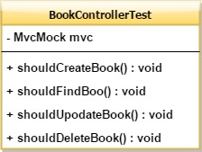
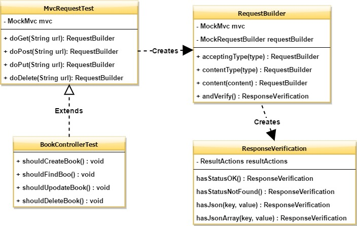

# Tests Refactoring

This repository contains the codebase that is subject to the refactoring.

Depending on the number of attendees (which in unlimited) we might refactor everything together on the projector or each one can try to follow the same on their laptops.

## Requirements

- Java 1.8
- IntelliJ (Community Edition)
- Maven 3

# Motivation

"It's not me - it's the team". How many times have you heard such an excuse for your team's ugly legacy code?
We will change it into "What I can do to make my team's code better" by example :-)

# What is the goal?

## Before refactoring

## After refactoring towards Fluent Builder design pattern.

## Importing Code for the workshop

Run IntelliJ. Free Community Edition is enough if you do not have a licence :-)

Then import project as maven one (once you've installed maven).

